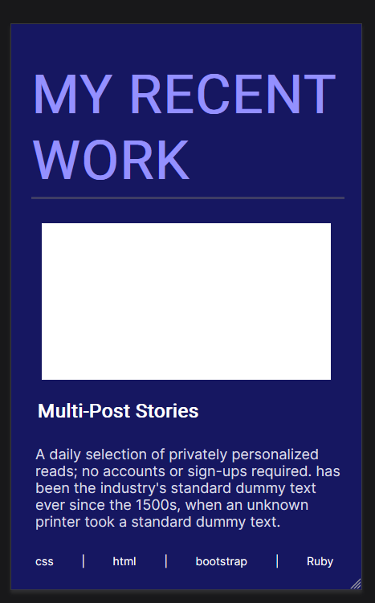
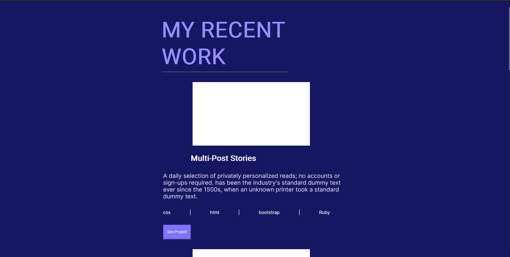
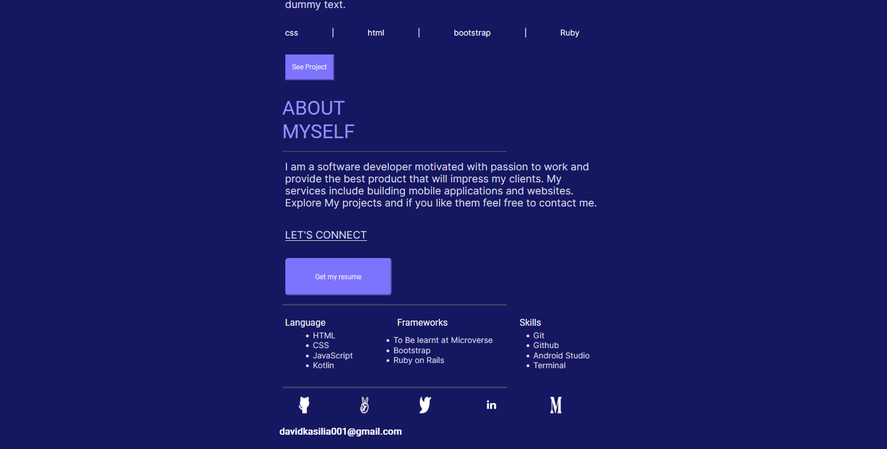
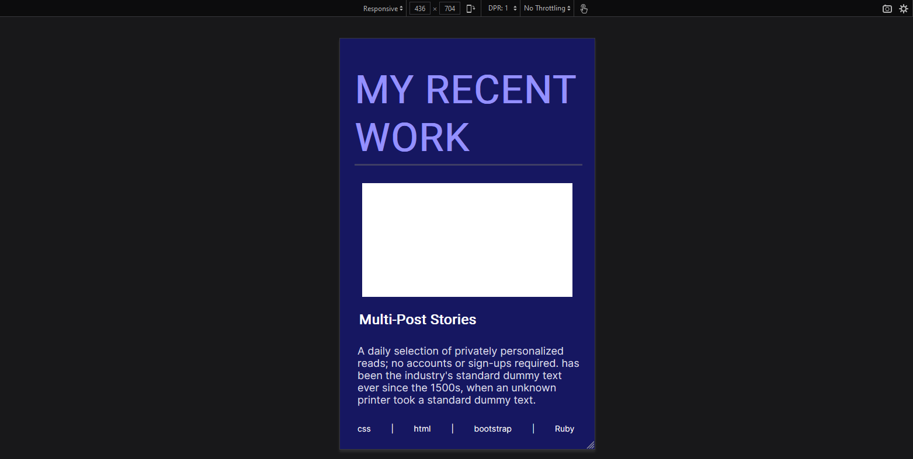
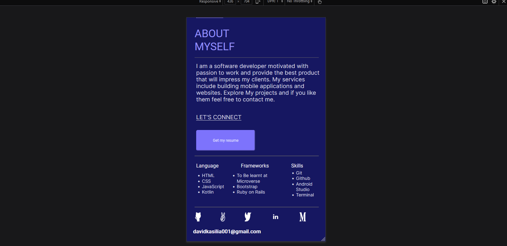

# My-Portfolio-Mobile-Version-Second-Milestone
Day 4  Week 1 Project Of Creating A Portfolio Mobile Version Second Milestone Using A Template From Figma Design Using HTML and CSS

# My Third Microverse Project In The Curriculum

<ul>
<li>This Project was about my portfolio recent works section and about me section mobile version.</li>
<li>The page is responsive to any screen size.</li>
</ul>

# Built with
<ul>
<li>HTML</li>
<li>CSS</li>
</ul>

# Prerequisites
<ul>
<li>VSCode</li>
<li>Git</li>
<li>Browser With Developer Tools</li>
</ul>

# Project Setup
<ol>
<li>Created a Github Repository</li>
<li>Cloned the created repository to my local machine</li>
<li>I created setup-project branch to create all the files needed for the project. These Files include:
        <ul>
            <li>.github/workflows directory to store the linter.yml file</li>
            <li>images directory to store the images used in creating this project.</li>
            <li>stylesheet directory to store the style.css file for styling the website</li>
            <li>index.html to write the HTML code.</li>
        <ul></li>
<li>Merged setup-project with the main branch
<li>Created the initialization-project branch to build the project code.</li>
<li>Opened the folder Using VSCode.<li>
<li>Completed the HTML code first</li>
<li>Completed the CSS part.</li>
</ol>

# Recent Work Section Of The Project

# About Me Section Of The Page

This Template from Figma had no about me section. I took into consideration the template from the Requirements Project The template given there. I tried to maintain the look and style of the page.

# Run Tests
I tested the website by running the code to a live server and opened it with Mozilla Firefox.To ensure the Webpage was responsive and was in a mobile version with both sections. I used the developer tools to see if it was responsive.

My Recent Work Responsive Section (Mobile Version)

About Me Responsive Section (Mobile Version)
# Authors
David Kasilia Mwanzia
<ul>
<li>Github <a href="https://github.com/David-Kasilia">Link To Github Profile</a></li>
<li>Linkedin <a href="https://www.linkedin.com/in/david-kasilia-846241211/">Link To Linkedin Profile</a></li>
<li>Twitter <a href="https://twitter.com/DavidKasilia">Link To Twitter Profile</a></li>
</ul>

# Contributing
Contributions, issues, and feature request are welcome anytime.

# Show your support
Give a Like or a Star if you like this project.

# Acknowledgements
Microverse